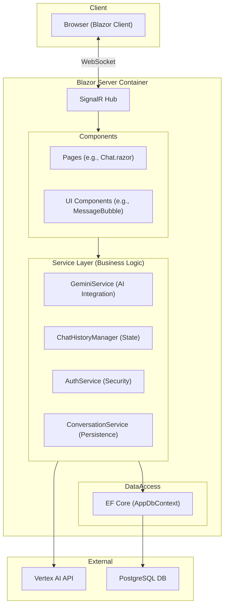

# Gemini Chat - Blazor Web App

## Project Overview

Gemini Chat is a production-grade Blazor Web Application that provides a real-time chat interface for Google's Vertex AI Gemini 3 models. It features streaming responses, collapsible "thinking" process visualization, robust chat history management, and system prompt customization. The application is designed with a Backend-for-Frontend (BFF) architecture using Blazor Server and .NET 10.

## Technology Stack

### Core
*   **Framework**: .NET 10 (ASP.NET Core)
*   **Frontend**: Blazor Server (InteractiveServer Render Mode)
*   **Language**: C# 13+
*   **Styling**: Tailwind CSS (Atomic CSS)
*   **Database**: PostgreSQL (via EF Core 9) / Supabase

### AI & Integration
*   **SDK**: `Google.GenAI` (v0.14.0+)
*   **Platform**: Google Vertex AI
*   **Models**: Gemini 3 Flash / Pro (Preview)

### Infrastructure
*   **Containerization**: Docker & Docker Compose
*   **Logging**: Serilog (Console & File)
*   **Authentication**: JWT / Cookie-based (Bcrypt for hashing)

## Architecture

The project follows a **Modular Monolith** style with a **BFF (Backend for Frontend)** pattern suited for Blazor Server.



### Key Directories

*   `VertexAI/Components/`: Blazor UI components (`Pages/` for routes, `Chat/` for feature-specific UI).
*   `VertexAI/Services/`: Business logic and external integrations (`GeminiService.cs`, `AuthService.cs`).
*   `VertexAI/Data/`: EF Core context (`AppDbContext.cs`) and Entities (`Conversation.cs`, `User.cs`).
*   `VertexAI/GCPKey/`: Service account credentials (ignored in git).
*   `VertexAI/wwwroot/`: Static assets (JS interop, CSS).

## Operational Commands

### Local Development
Prerequisites: .NET 10 SDK, PostgreSQL running locally.

```bash
# Set Google Credentials
export GOOGLE_APPLICATION_CREDENTIALS="/path/to/key.json"

# Run the application
cd VertexAI
ASPNETCORE_ENVIRONMENT=Development dotnet run --urls "http://localhost:5000"
```

### Docker Deployment
The project includes a helper script `run-docker.sh` for easy deployment.

```bash
cd VertexAI

# Build and Run
./run-docker.sh

# Run without rebuilding (if image exists)
./run-docker.sh -s

# Run with Custom Config
GCP_KEY_PATH=./key.json PROJECT_ID=my-project ./run-docker.sh
```

## Configuration (Environment Variables)

| Variable | Description | Default |
| :--- | :--- | :--- |
| `GOOGLE_APPLICATION_CREDENTIALS` | Path to GCP Service Account JSON | Required |
| `DATABASE_URL` | PostgreSQL Connection String | `ConnectionStrings:Default` |
| `VertexAI__ProjectId` | GCP Project ID | - |
| `VertexAI__Location` | Vertex AI Region | `global` |
| `VertexAI__ModelName` | Gemini Model ID | `gemini-3-flash-preview` |

## Coding Standards & Conventions

Refer to `CODING_STANDARDS.md` for full details.

*   **File Size**: Keep files small (Services < 300 lines, Components < 200 lines).
*   **Naming**: `PascalCase` for public members, `_camelCase` for private fields.
*   **Async**: All I/O bound operations must be `async/await`.
*   **Comments**: XML documentation required for public APIs.
*   **Safety**:
    *   No hardcoded secrets (use `.env` or `appsettings.json`).
    *   Sanitize Markdown inputs.
    *   No logic in Razor Pages (delegate to Services).

## Key Features

1.  **Streaming Responses**: Real-time token streaming from Vertex AI.
2.  **Thinking Process**: Visual toggle for "Chain of Thought" data if provided by the model.
3.  **System Presets**: Pre-configured personas (Assistant, Translator, Coder).
4.  **Auto-Summarization**: Logic in `ChatHistoryManager` compresses context when token limits are reached.
5.  **Multi-Session**: Users can create and switch between multiple conversation threads.

## Current State & Roadmap

*   **Current Phase**: Phase 1 (User System & Persistence).
*   **Recent Updates**:
    *   Added `TokenCount` column to `conversations` table.
    *   Implemented `GeminiService` with `Google.GenAI` SDK.
    *   Set up basic Docker support.

*   **Next Steps**:
    *   Refine User Authentication (JWT/Cookie polish).
    *   Implement Multi-tenancy (Phase 2).
    *   Add RAG (Retrieval-Augmented Generation) support (Phase 3).
