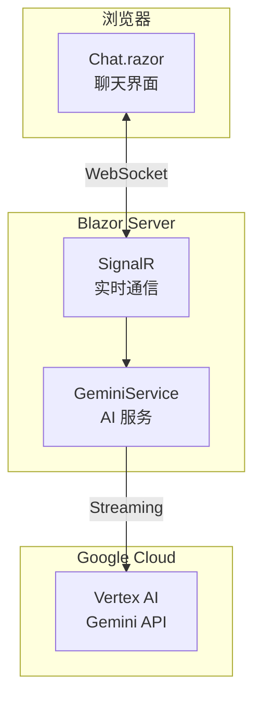
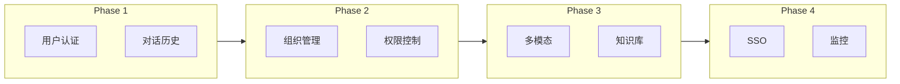

# Gemini Chat - Blazor Web App

基于 Vertex AI Gemini 的 Blazor Web 聊天应用，支持思考过程可视化。

## 功能

- 流式 AI 回复
- 思考过程可折叠显示
- 可配置系统提示词
- Docker 部署支持

## 架构



**数据流**：用户输入 → SignalR → GeminiService → Vertex AI → 流式返回 → UI 实时更新

## 本地开发

```bash
# 设置环境变量
export GOOGLE_APPLICATION_CREDENTIALS=/path/to/key.json

# 运行
cd VertexAI
ASPNETCORE_ENVIRONMENT=Development dotnet run --urls "http://localhost:5000"
```

访问 http://localhost:5000

## Docker 部署

```bash
cd VertexAI

# 构建镜像
docker build -t gemini-chat .

# 运行
./run-docker.sh
```

访问 http://localhost:8880

### 自定义配置

```bash
GCP_KEY_PATH=/your/key.json \
PROJECT_ID=your-project \
SYSTEM_PROMPT="自定义提示词" \
./run-docker.sh
```

## 配置说明

| 配置项       | 说明           | 默认值                 |
| ------------ | -------------- | ---------------------- |
| ProjectId    | GCP 项目 ID    | -                      |
| Location     | Vertex AI 区域 | global                 |
| ModelName    | 模型名称       | gemini-3-flash-preview |
| SystemPrompt | 系统提示词     | -                      |

配置文件：`appsettings.json` / `appsettings.Production.json`

## 目录结构

```
VertexAI/
├── Components/
│   ├── App.razor          # 根组件
│   ├── Routes.razor       # 路由配置
│   └── Pages/
│       └── Chat.razor     # 聊天页面
├── Services/
│   └── GeminiService.cs   # AI 服务封装
├── Program.cs             # 应用入口
├── Dockerfile             # Docker 构建
├── run-docker.sh          # 部署脚本
└── appsettings.json       # 配置文件
```

## 发展路线

### Phase 1: 用户系统

- 用户注册/登录 (JWT)
- 对话历史持久化 (PostgreSQL)
- 每用户独立会话

### Phase 2: 多租户

- 组织/团队管理
- 角色权限控制 (Admin/User)
- API 配额管理

### Phase 3: 增强功能

- 多模态输入 (图片/文件)
- 自定义 AI 人设
- 对话分享/导出
- RAG 知识库接入

### Phase 4: 企业级

- SSO 集成
- 审计日志
- 多区域部署
- 监控告警


